# 🛡️ MindGuard  
## Explainable Student Wellbeing Risk Assessment Dashboard

<div align="center">


</div>

---

## 📋 Overview

MindGuard is a **full-stack, explainable machine learning dashboard** that estimates a student's **mental wellbeing risk level** (**Low / Medium / High**) based on lifestyle, academic, and psychosocial inputs.

Unlike black-box prediction demos, this system focuses on **interpretability, transparency, and actionable insights**, answering three core questions:

1. **What is the predicted risk level?**  
2. **Why did the model predict this?**  
3. **What can realistically be improved next?**

> ⚠️ **Academic Disclaimer**  
> This project is developed strictly for academic and demonstration purposes.  
> The output is a **statistical risk estimate**, not a medical diagnosis or clinical advice.

---

## 📌 Table of Contents

- [Project Motivation](#project-motivation)
- [What This System Delivers](#what-this-system-delivers)
- [System Architecture](#system-architecture)
- [End-to-End Data Flow](#end-to-end-data-flow)
- [Technology Stack](#technology-stack)
- [Repository Structure](#repository-structure)
- [Dashboard Capabilities](#dashboard-capabilities)
- [Machine Learning Model](#machine-learning-model)
- [Explainability Methodology](#explainability-methodology)
- [API Design](#api-design)
- [Local Setup](#local-setup)
- [Model Persistence](#model-persistence)
- [Limitations](#limitations)
- [Future Improvements](#future-improvements)

---

## 🎯 Project Motivation

Student mental health issues often remain **unnoticed until they escalate**, largely because institutions lack a structured, interpretable way to synthesize behavioral and psychological indicators.

MindGuard addresses this gap by:

- 📊 Structuring wellbeing-related signals into a unified dataset  
- 🤖 Training a **transparent linear model (Logistic Regression)**  
- 🖥️ Deploying the model via a **dashboard-style web interface**  
- 📈 Visually explaining *why* a risk prediction was made  

This project was explicitly designed to satisfy academic requirements for:

- Dataset justification  
- Linear / logistic regression modeling  
- Visual dashboard-based insights  
- Model evaluation and reasoning  

---

## ✅ What This System Delivers

| Feature | Description |
|---------|-------------|
| ✅ Risk Classification | 3-level wellbeing risk classification (Low/Medium/High) |
| ✅ High Accuracy | ROC-AUC ≈ **0.925** on test data |
| ✅ Model Persistence | Pickle-based reusable ML model |
| ✅ Explainability | Factor-level reasoning with visual explanations |
| ✅ Modern UI | Horizontally structured web dashboard |
| ✅ Actionable Insights | Clear separation of risk drivers vs protective factors |

---

## 🏗️ System Architecture

### High-Level Architecture


### Component Architecture


---

## 🔄 End-to-End Data Flow

### Prediction Request Flow

```mermaid
sequenceDiagram
    autonumber
    participant U as 👤 User
    participant C as 🖥️ React Client
    participant S as ⚙️ Express Server
    participant P as 🐍 Python Engine
    participant M as 🤖 Pickle Model

    U->>C: Fill assessment form
    C->>C: Validate inputs (Zod)
    C->>S: POST /api/predict (JSON)
    S->>S: Schema validation
    S->>P: Spawn Python subprocess
    P->>M: Load pickle model
    P->>P: Feature preprocessing
    P->>P: StandardScaler transformation
    P->>M: predict_proba()
    M-->>P: Class probabilities
    P->>P: Compute factor contributions
    P->>P: Generate explanations
    P-->>S: Prediction + explanations (JSON)
    S-->>C: Response with metadata
    C->>C: Parse and format data
    C-->>U: Render dashboard visuals
```



### Explainability Pipeline

```mermaid
flowchart TB
    A[📝 User Inputs] --> B[🔄 Feature Encoding]
    B --> C[📊 Feature Vector Creation]
    C --> D[⚖️ StandardScaler Transform]
    D --> E[🤖 Logistic Regression]
    
    E --> F[📈 Class Probabilities]
    E --> G[🔢 Model Coefficients]
    
    C --> H[💡 Contribution Calculation]
    G --> H
    D --> H
    
    H --> I[📦 Factor Grouping]
    I --> J[🎯 Risk Drivers]
    I --> K[🛡️ Protective Factors]
    
    J --> L[📊 Waterfall Chart]
    K --> L
    I --> M[🕸️ Radar Chart]
    F --> N[🎚️ Risk Gauge]
    
    style A fill:#1e293b,stroke:#3b82f6,color:#fff
    style E fill:#1e293b,stroke:#f59e0b,color:#fff
    style L fill:#1e293b,stroke:#10b981,color:#fff
    style M fill:#1e293b,stroke:#10b981,color:#fff
    style N fill:#1e293b,stroke:#10b981,color:#fff
```



### Risk Assessment Logic

flowchart LR
    Start([Input Data]) --> Encode[Feature Encoding]
    Encode --> Scale[StandardScaler]
    Scale --> Predict[Logistic Regression]
    
    Predict --> Prob{Probability Distribution}
    
    Prob -->|P Low greater than 0.6| Low[Low Risk]
    Prob -->|P Med greater than 0.4| Med[Medium Risk]
    Prob -->|P High greater than 0.5| High[High Risk]
    
    Low --> Explain[Generate Explanations]
    Med --> Explain
    High --> Explain
    
    Explain --> Visual[Visualizations]
    Explain --> Suggest[Improvement Suggestions]
    
    Visual --> Output([Dashboard])
    Suggest --> Output
    
    style Start fill:#1e293b,stroke:#3b82f6,color:#fff
    style Low fill:#10b981,stroke:#fff,color:#fff
    style Med fill:#f59e0b,stroke:#fff,color:#000
    style High fill:#ef4444,stroke:#fff,color:#fff
    style Output fill:#1e293b,stroke:#3b82f6,color:#fff
---

## 🛠️ Technology Stack

### Frontend Stack


### Backend Stack


### Machine Learning Stack


---

## 📁 Repository Structure

```
Data-Insights/
│
├── 📂 client/                          # Frontend application
│   ├── 📂 src/
│   │   ├── 📂 pages/
│   │   │   ├── Assessment.tsx          # Main assessment form
│   │   │   ├── Analytics.tsx           # Results dashboard
│   │   │   └── Landing.tsx             # Landing page
│   │   │
│   │   ├── 📂 components/
│   │   │   ├── RiskTierGauge.tsx       # Risk level gauge
│   │   │   ├── RiskContributionWaterfall.tsx  # Factor waterfall
│   │   │   ├── LifestyleBalanceRadar.tsx      # Lifestyle radar
│   │   │   ├── BeforeAfterMiniComparison.tsx  # Improvement bars
│   │   │   └── ImprovementSuggestions.tsx     # Action items
│   │   │
│   │   ├── 📂 lib/
│   │   │   └── utils.ts                # Utility functions
│   │   │
│   │   └── App.tsx                     # Root component
│   │
│   ├── package.json
│   └── tailwind.config.js
│
├── 📂 server/                          # Backend application
│   ├── index.ts                        # Express server entry
│   ├── routes.ts                       # API route handlers
│   └── predict.py                      # ML inference script
│
├── 📂 python codes of model and dataset and pickle file/
│   ├── Hackathon-2 endterm update after feedback.ipynb
│   ├── Student_Wellbeing_Synthetic.csv # Training dataset
│   └── logistic_regression_final.pkl   # Trained model
│
├── 📂 shared/
│   └── schema.ts                       # Shared TypeScript types
│
├── package.json                        # Root package config
└── README.md                           # This file
```

---

## 📊 Dashboard Capabilities

### Prediction Summary Panel

```mermaid
graph TB
    A[Prediction Summary] --> B[Risk Tier Badge]
    A --> C[Confidence Score]
    A --> D[Key Metrics]
    
    B --> B1[🟢 Low Risk]
    B --> B2[🟡 Medium Risk]
    B --> B3[🔴 High Risk]
    
    C --> C1[Probability: 0.XX]
    C --> C2[Model Confidence: High/Med/Low]
    
    D --> D1[Top 3 Risk Drivers]
    D --> D2[Top 3 Protective Factors]
    
    style A fill:#1e293b,stroke:#3b82f6,color:#fff
    style B1 fill:#10b981,stroke:#fff,color:#fff
    style B2 fill:#f59e0b,stroke:#fff,color:#000
    style B3 fill:#ef4444,stroke:#fff,color:#fff
```



### Explainability Visuals

| Visualization | Purpose | Insight Provided |
|---------------|---------|------------------|
| **Waterfall Chart** | Factor Contributions | Shows positive/negative contributors to risk |
| **Radar Chart** | Lifestyle Balance | Compares dimensions (sleep, study, stress, etc.) |
| **Before/After Bars** | Improvement Potential | Demonstrates impact of targeted changes |
| **Gauge Chart** | Risk Level | Visual risk tier with confidence interval |

### Dashboard Layout


---

## 🤖 Machine Learning Model

### Model Type

**Logistic Regression (Multiclass, One-Vs-Rest)**

### Why Logistic Regression?


### Performance Metrics (Top-50 Features)

| Metric | Value | Interpretation |
|--------|-------|----------------|
| **Accuracy** | 0.851 | 85.1% correct classifications |
| **Macro F1** | 0.732 | Balanced performance across classes |
| **ROC-AUC** | 0.925 | Excellent discrimination ability |
| **Log Loss** | 0.358 | Low prediction uncertainty |

### Model Training Pipeline

```mermaid
flowchart TB
    A[📊 Raw Dataset] --> B[🧹 Data Cleaning]
    B --> C[🔍 Feature Engineering]
    C --> D[✂️ Train/Test Split]
    
    D --> E[📈 Training Set 80%]
    D --> F[📊 Test Set 20%]
    
    E --> G[⚖️ StandardScaler Fit]
    G --> H[🤖 Logistic Regression Fit]
    
    F --> I[⚖️ StandardScaler Transform]
    I --> J[🔮 Model Prediction]
    
    J --> K[📈 Performance Evaluation]
    K --> L{Metrics<br/>Acceptable?}
    
    L -->|No| M[🔧 Hyperparameter Tuning]
    M --> H
    
    L -->|Yes| N[💾 Pickle Model]
    N --> O[🚀 Deploy to Server]
    
    style A fill:#1e293b,stroke:#3b82f6,color:#fff
    style H fill:#1e293b,stroke:#f59e0b,color:#fff
    style N fill:#1e293b,stroke:#10b981,color:#fff
    style O fill:#1e293b,stroke:#10b981,color:#fff
```



---

## 🔍 Explainability Methodology

### Core Principle

Logistic regression computes a linear decision function:

```
Score = Intercept + Σ(feature_i × coefficient_i)
```

This allows direct estimation of:
- ✅ Factors increasing risk
- ✅ Factors reducing risk

### Implementation Process


### Factor Grouping


### Contribution Calculation


---

## 🔌 API Design

### Endpoint: `POST /api/predict`

#### Request Schema

```json
{
  "age": 20,
  "gender": "Male",
  "academicLevel": "Undergrad",
  "studyHours": 6,
  "sleepHours": 6,
  "screenTime": 8,
  "outdoorActivity": 1,
  "stressLevel": 4,
  "academicPressure": 4,
  "hopelessness": 2,
  "financialComfort": 3,
  "institutionalSupport": 2,
  "talkTo": "Friends",
  "openness": "Maybe"
}
```

#### Response Schema

```json
{
  "riskLevel": "Medium",
  "probability": 0.67,
  "confidence": "high",
  "factors": {
    "risk_drivers": [
      { "name": "High Screen Time", "impact": 0.45 },
      { "name": "Academic Pressure", "impact": 0.38 },
      { "name": "Low Sleep", "impact": 0.32 }
    ],
    "protective_factors": [
      { "name": "Social Support", "impact": -0.28 },
      { "name": "Financial Comfort", "impact": -0.22 }
    ]
  },
  "improvements": [
    {
      "factor": "Screen Time",
      "current": 8,
      "suggested": 5,
      "potential_impact": "12% risk reduction"
    }
  ],
  "metadata": {
    "model_version": "1.0",
    "features_used": 50,
    "computation_time_ms": 145
  }
}
```

### API Flow


---

## 🖥️ Local Setup

### Prerequisites

- **Node.js** (LTS version, v18+)
- **npm** (comes with Node.js)
- **Python** 3.8+
- **pip** (Python package manager)

### Installation Steps

#### 1. Clone Repository

```bash
git clone https://github.com/yourusername/mindguard.git
cd mindguard
```

#### 2. Install Dependencies

```bash
# Install Node.js dependencies
npm install

# Install Python dependencies
pip install scikit-learn numpy pandas
```

#### 3. Verify Pickle Model

Ensure the model file exists:

```bash
ls "python codes of model and dataset and pickle file/logistic_regression_final.pkl"
```

#### 4. Run Development Server

```bash
npm run dev
```

#### 5. Open Application

Navigate to:
```
http://localhost:5000
```

### Troubleshooting

| Issue | Solution |
|-------|----------|
| Port 5000 in use | Change port in `server/index.ts` |
| Python not found | Add Python to PATH |
| Pickle load error | Check scikit-learn version compatibility |
| Module not found | Run `npm install` again |

---

## 💾 Model Persistence (Pickle)

### File Details

```
📦 logistic_regression_final.pkl
├── Size: ~500 KB
├── Format: Python Pickle (Protocol 4)
├── Contents:
│   ├── Logistic Regression coefficients
│   ├── StandardScaler parameters (mean, std)
│   ├── Feature names
│   └── Model metadata
```

### Loading the Model

```python
import pickle

# Load model
with open("logistic_regression_final.pkl", "rb") as f:
    model = pickle.load(f)

# Use model
predictions = model.predict(X_test)
probabilities = model.predict_proba(X_test)
```

### Important Notes

⚠️ **Cannot be opened manually** - Binary format  
⚠️ **Version-sensitive** - scikit-learn version must match  
⚠️ **Feature order matters** - Input order must match training  
✅ **Portable** - Works across systems with compatible Python/sklearn  

---

## ⚠️ Limitations

This project has several important limitations that users should be aware of:

### Data Limitations


### Specific Constraints

| Category | Limitation | Impact |
|----------|-----------|--------|
| **Dataset** | Synthetic data | May not reflect real-world patterns |
| **Clinical** | No validation | Cannot be used for diagnosis |
| **Temporal** | No tracking | Cannot show trends over time |
| **Explainability** | Linear approximation | Complex interactions not captured |
| **Privacy** | No encryption | Not suitable for sensitive data |

### Ethical Considerations

> ⚠️ **Critical Disclaimer**
> 
> This system produces **statistical estimates**, not medical diagnoses.  
> Always consult qualified mental health professionals for actual assessment and treatment.

---

## 🚀 Future Improvements

### Roadmap


### Planned Features

#### 1. Real Institutional Integration


#### 2. Longitudinal Tracking

- Track wellbeing over time
- Identify trends and patterns
- Monitor intervention effectiveness
- Generate progress reports

#### 3. Advanced Explainability

Replace linear approximation with:
- **SHAP (SHapley Additive exPlanations)**
- **LIME (Local Interpretable Model-agnostic Explanations)**
- Interaction effects visualization

#### 4. Admin Analytics Dashboard


#### 5. PDF Report Export

- Personalized wellbeing reports
- Factor analysis summary
- Improvement recommendations
- Progress tracking charts

---

## 📄 License

This project is developed for **academic purposes only**.

**Restrictions:**
- ❌ Not for commercial use
- ❌ Not for clinical diagnosis
- ❌ Not for production medical applications

**Permissions:**
- ✅ Educational use
- ✅ Research purposes
- ✅ Academic demonstrations

---

## 🤝 Contributing

Contributions are welcome for academic improvement purposes.

### How to Contribute

1. Fork the repository
2. Create a feature branch (`git checkout -b feature/improvement`)
3. Commit changes (`git commit -m 'Add improvement'`)
4. Push to branch (`git push origin feature/improvement`)
5. Open a Pull Request

---

## 📧 Contact

For academic inquiries or collaboration:

- **Project Maintainer**: [Your Name]
- **Institution**: [Your Institution]
- **Email**: [your.email@institution.edu]

---

## 🙏 Acknowledgments

- **scikit-learn** for machine learning tools
- **React** and **TypeScript** for frontend framework
- **Recharts** for visualization library
- **shadcn/ui** for UI components
- Academic advisors and reviewers

---

<div align="center">

**⚠️ Remember: This is an academic tool, not a replacement for professional mental health services ⚠️**

---

Made with 💙 for student wellbeing research

</div>
